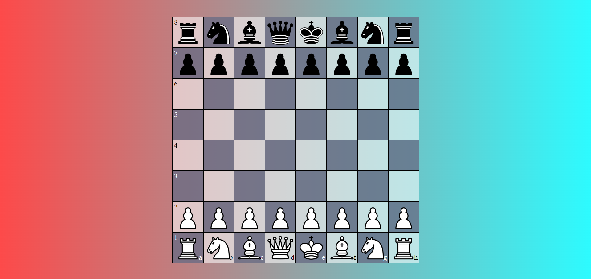
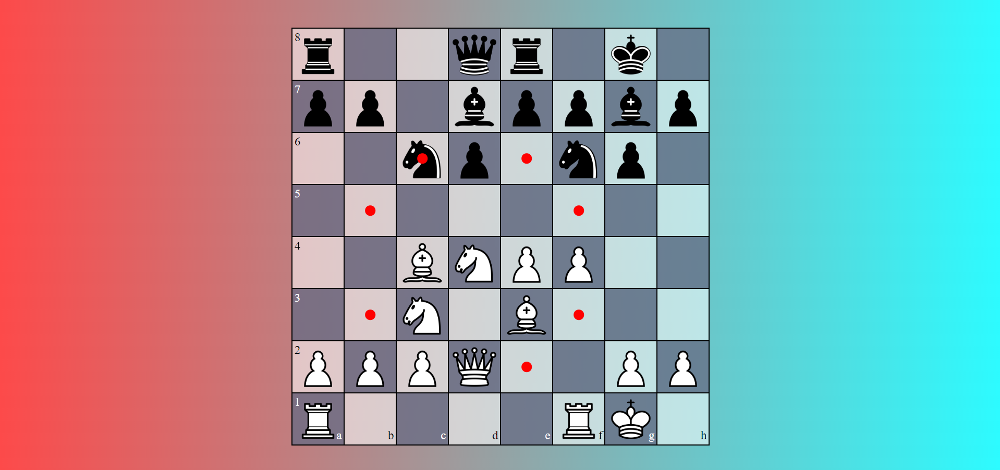
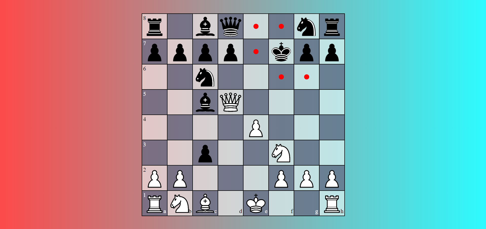
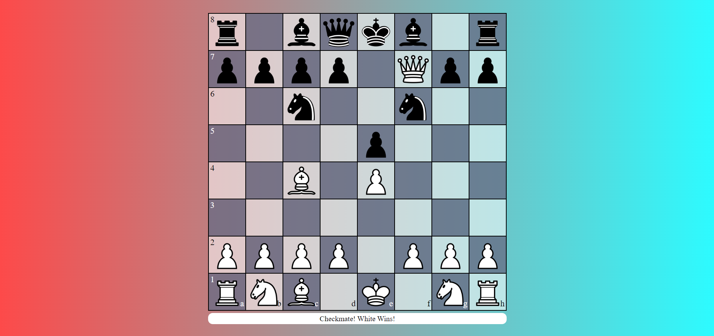

# Chess Game

## Project Aim
This project was done to create a fully functional chess game where two players could compete on the same interface. It showcases my early coding skills and problem solving capabilities, especially when dealing with the complex logic around chess.

## Disclaimer
This chess game was one of my first coding projects. Although the code may be a bit unrefined due to the complex logic required, it laid the groundwork for my growth as a developer. Looking back, I can see my progress in both coding style and project structure.

## Technologies Used
- **Frontend**: HTML, CSS, JavaScript

## Key Features
- **Interactive Chessboard**: Players can select pieces and see all legal moves indicated by red dots.
- **Move Validation**: Pieces can only be selected if they have valid moves.
- **Checkmate Detection**: The game ends with a winner message when a checkmate occurs.
- **User-Friendly Interface**: The board dynamically updates after every move, offering a smooth playing experience.

<table>
  <tr>
    <td></td>
    <td></td>
  </tr>
  <tr>
    <td></td>
    <td></td>
  </tr>
</table>
